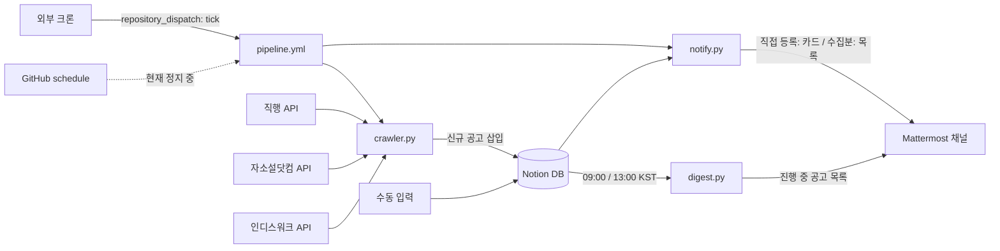

# job-radar 📡

채용 사이트(직행·자소설닷컴·인디스워크)에서 IT 신입/인턴 공고를 자동 수집해 **Notion 데이터베이스**에 쌓고, 새 공고가 등록되면 **Mattermost**로 알림을 보내는 봇.
서버 없이 **GitHub Actions**만으로 동작한다.



## 구성 요소

`pipeline.yml`이 정기 실행을 담당하며 `crawler.py` → `notify.py`를 한 잡에서 순서대로 돌린다. 두 스크립트가 상태 파일을 각자 커밋하며 경합하지 않게 하기 위해서다.

| 스크립트 | 실행 경로 | 주기 | 역할 |
| --- | --- | --- | --- |
| `crawler.py` | `pipeline.yml` (수동은 `crawler.yml`) | 30분 | 세 사이트에서 IT 신입/인턴 공고 수집 → Notion 삽입 (`직무` 칸에 `[직행]` 등 출처 표시). **등록일이 `RECENT_DAYS`(기본 14일) 이내인 공고만** |
| `notify.py` | `pipeline.yml` (수동은 `notify.yml`) | 30분 (08:00~18:30 KST) | 새 행을 감지해 @all 알림. **기업명·직무·링크가 채워진 행만** 발송하고 미완성 행은 채워질 때까지 대기(최대 7일). **직접 등록분은 개별 카드, 크롤러 수집분은 목록 한 장**으로 나눠 보낸다 |
| `digest.py` | `digest.yml` | 매일 09:00 / 13:00 KST | 마감이 지나지 않은 공고 전체를 마감 임박 순으로 발송 |

수동으로 행을 추가해도 알림이 나간다. Notion DB가 유일한 관리 지점이다.

### GitHub schedule이 멈춰 있다

2026-08-26T09:54Z부터 이 리포의 `schedule` 트리거가 조용히 발화하지 않는다. 워크플로는 모두 `active`, Actions도 `enabled`, 기본 브랜치도 `main`이고 `workflow_dispatch`는 매번 정상 동작한다. 크론 주기 완화와 커밋 활동 모두 효과가 없었다. **원인 미확정 — GitHub 쪽 문제로 추정한다.**

그래서 `pipeline.yml`은 `repository_dispatch`로도 깨울 수 있다. 외부 크론(cron-job.org 등)에서:

```
POST https://api.github.com/repos/<owner>/<repo>/dispatches
Authorization: Bearer <PAT: contents 쓰기 권한>
Accept: application/vnd.github+json
Body: {"event_type": "tick"}
```

`schedule`도 그대로 남겨뒀으므로 GitHub 쪽이 복구되면 자동으로 다시 돈다. 두 경로가 겹쳐 실행돼도 `crawl_state.json` / `state.json`의 중복 제거가 있어 안전하다.

## 알림 예시

**새 공고 (즉시, @all)**
> 💼 **채용공고봇** — @all 새 채용공고가 등록되었습니다.
> ┃ **STX엔진 · [자소설] 2026 신입/경력 수시채용 (서버운용)**
> ┃ 직무: … 마감일: 2026-09-08 (D-13)

**야간 대기분 (아침 08:00, @all — 여러 건이면 한 메시지로)**
> 💼 **채용공고봇** — @all 새 채용공고 4건이 등록되었습니다.
> ┃ **2026-09-01 (D-5)** · 회사명 · [직행] 백엔드 신입
> ┃ **미정** · 회사명 · [자소설] 인턴

**데일리 다이제스트 (하루 2회, 멘션 없음)**
> 📅 **채용공고봇** — 📋 2026-08-26 기준 진행 중인 채용공고 19건
> ┃ **2026-08-28 (D-2)** · 회사명 · 직무 …

## 설정 방법

### 1. Notion

1. [my-integrations](https://www.notion.so/my-integrations)에서 Internal Integration 생성 → `ntn_` 토큰 확보
2. Capabilities: **콘텐츠 읽기 + 콘텐츠 삽입** 필수 (업데이트는 선택)
3. 대상 페이지 `···` → 연결 → Integration 추가 (빠뜨리면 API가 404 반환)
4. DB에 필요한 속성: `기업명`(제목) · `직무`(텍스트) · `링크`(URL) · `마감일`(날짜)

### 2. Mattermost

통합 → 유입 웹후크 → 웹후크 추가(채널 잠금 권장) → URL 확보

### 3. GitHub Secrets

Settings → Secrets and variables → Actions에 등록:

| Name | Value |
| --- | --- |
| `NOTION_TOKEN` | `ntn_...` |
| `NOTION_DATA_SOURCE_ID` | Notion DB의 데이터 소스 ID (`···` → 데이터 소스 관리에서 복사) |
| `MM_WEBHOOK_URL` | `https://<서버>/hooks/...` |

등록 후 Actions 탭에서 각 워크플로를 **Run workflow**로 1회 수동 실행해 확인한다.

## 로컬 개발

```bash
pip install requests
cp .env.example .env          # 값 채우기 (.env는 gitignore됨)
set -a; source .env; set +a
python crawler.py             # 최근 14일 공고 수집
python notify.py              # 새 행 알림
python digest.py              # 진행 중 공고 목록 즉시 발송

# 백필: 범위를 넓히고 캡을 풀어 한 번에 밀어넣는다
RECENT_DAYS=14 MAX_PAGES=25 MAX_INSERT_PER_RUN=2000 python crawler.py
SKIP_SEND=1 python notify.py  # 백필분을 발송 없이 발송완료로만 기록
```

| 환경변수 | 기본값 | 용도 |
| --- | --- | --- |
| `RECENT_DAYS` | 14 | 이 일수 이내에 **등록된** 공고만 수집 |
| `MAX_PAGES` | 20 | 소스당 넘길 최대 페이지 수 |
| `MAX_INSERT_PER_RUN` | 20 | 한 실행에서 소스당 삽입 상한 (초과분은 다음 실행으로 이월) |
| `FORCE_SEND` | - | 야간 무음을 무시하고 발송 |
| `SKIP_SEND` | - | 발송하지 않고 발송완료로만 기록 (백필 직후 1회용) |

## 상태 파일 (커밋 대상)

- `state.json` — notify의 마지막 확인 시각 + 발송한 행 ID + 입력 대기 중인 행 ID
- `crawl_state.json` — 크롤러가 이미 **삽입을 마친** 출처별 공고 ID + 교차중복 키 + 마지막 실행일. 캡에 걸려 못 넣은 건과 삽입 실패분은 기록하지 않아 다음 실행이 이어서 처리한다

두 파일은 워크플로가 자동 커밋한다. **`.gitignore`에 넣으면 안 된다.**

## 커스터마이즈 포인트

| 바꾸고 싶은 것 | 위치 |
| --- | --- |
| 수집 직군 (예: 게임 추가) | `sources/zighang.py`의 `DEPTH_ONES`, `sources/jasoseol.py`의 `IT_DUTY_IDS`, `sources/inthiswork.py`의 `TAGS_IT` |
| @all 멘션 끄기 | `notify.py` `build_payload()`의 `text` |
| 다이제스트 시간 | `digest.yml`의 cron (UTC 기준, KST−9시간) |
| 야간 무음 시간대 | `notify.py`의 `QUIET_START` / `QUIET_END` + `notify.yml`의 cron (둘 다 같이 고쳐야 함) |
| 일괄 메시지 최대 줄 수 | `notify.py`의 `MAX_BULK_LINES` |
| 알림 필수 필드 | `notify.py`의 `REQUIRED_PROPS` |
| 회당 최대 삽입 건수 | `crawler.py`의 `MAX_INSERT_PER_RUN` (환경변수로도 조정) |
| 수집할 등록일 범위 | `crawler.py`의 `RECENT_DAYS` |
| 직접 등록분을 카드로 보낼 상한 | `notify.py`의 `MAX_CARDS` (초과 시 목록으로 전환) |

## 운영 주의사항

- **cron은 UTC.** `0 0 * * *` = KST 09:00. 무료 러너는 혼잡 시 수 분~수십 분 지연될 수 있다
- **60일 규칙**: 커밋이 60일간 없으면 스케줄이 자동 비활성화되지만, 이 구성은 상태 파일을 계속 커밋하므로 자연 해결됨
- **웹훅 URL은 비밀**: URL만 알면 누구나 채널에 글을 쓸 수 있다. 리포는 Private 유지, 값은 Secrets로만
- Notion API 버전 `2025-09-03` (data_sources 엔드포인트) 고정
- Notion은 `created_time`을 분 단위로 절삭해 반환한다 — notify는 2분 버퍼 + ID 중복 제거로 대응
- **야간 대기 원리**: 무음 시간대에는 `state.json`을 저장하지 않아 `last_checked`가 그대로 남는다. 아침 08:00 첫 실행이 그 사이 생긴 행을 전부 조회해 한 메시지로 묶어 보낸다(별도 큐 파일 없음). 수집(crawler)은 24시간 계속 돌아 야간 공고를 놓치지 않는다
- **야간에 즉시 확인하고 싶을 때**: Actions에서 notify/digest를 **Run workflow**로 수동 실행하면 `FORCE_SEND=true`가 붙어 무음을 무시하고 발송한다. 로컬에서는 `FORCE_SEND=1 python notify.py`
- **조회량 자가조정**: 고정 커트라인으로 매번 훑으면 직행 기준 17페이지 x 2쿼리를 실행마다 받는다. `scan_since()`가 지난 실행 하루 전까지만 조회하고, 오래 멈춰 있었으면 `RECENT_DAYS`까지 거슬러 올라간다
- **레이트리밋**: 인디스워크가 연속 페이지 조회 중 429를 반환한 적이 있다. `sources/_http.get`이 `Retry-After`를 지켜 재시도하고, Notion 삽입도 429를 재시도한다
- **중복보다 유실이 나쁘다**: `cross_key`는 `회사명|마감일|직무`다. 직무를 빼면 한 회사가 같은 날 마감되는 여러 자리를 올렸을 때 하나만 남고 나머지가 조용히 사라진다
- 직행 API 호스트의 robots.txt는 크롤러 배제를 명시하고 있다. 이 봇은 웹 프론트가 쓰는 것과 동일한 공개 API를 호출하는 저부하 개인용이지만, 운영자 요청이 있으면 `crawler.py`에서 해당 소스를 제외할 것

## 확장 아이디어

- 마감 D-3 임박 공고만 골라 🚨 리마인드
- `자소서 문항1`이 비어 있는데 마감 임박한 공고 경고
- 관심 키워드(AI, 데이터 등) 포함 공고에 ⭐ 하이라이트
- `last_edited_time` 기반 공고 수정 감지
